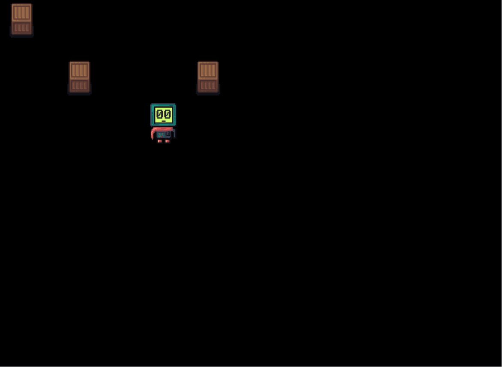

# Artificial Will Game and Game Engine

This is a game about a robot Will overcoming obstacles. The game has a very deep meaning I will come up later.

Also, this is my fun project of writing a game engine and a use case for my other projects, so I can test them in real application and improve:

- https://github.com/an-dr/abcmake - my CMake-compatible build system
- https://github.com/an-dr/hyphoria - my messaging framework
- https://github.com/an-dr/microlog - my logging library

## Prerequirements

Most of the deps are resolved via [vcpkg](https://github.com/microsoft/vcpkg) so:

1. Install vcpkg
2. Specify VCPKG_ROOT environment variable
3. Add to your CMake profile `--preset  vcpkg`

## IDE Setup

Open `artificial-will-game.code-workspace` in VSCode. Install recommended extensions when prompted.

Create your local `CMakeUserPresets.json` in the project root (gitignored) with a configure preset that inherits `vcpkg` and sets your `VCPKG_ROOT`. Example for arm64 Windows:

```json
{
  "version": 3,
  "configurePresets": [
    {
      "name": "arm64-debug",
      "displayName": "arm64 Debug",
      "inherits": "vcpkg",
      "generator": "Ninja",
      "binaryDir": "${sourceDir}/build/arm64-debug",
      "cacheVariables": {
        "CMAKE_BUILD_TYPE": "Debug",
        "VCPKG_TARGET_TRIPLET": "arm64-windows"
      },
      "environment": {
        "VCPKG_ROOT": "C:/tools/vcpkg"
      }
    }
  ],
  "buildPresets": [
    {
      "name": "arm64-debug",
      "configurePreset": "arm64-debug"
    }
  ]
}
```

Then create `.vscode/settings.json` (gitignored) pointing to your preset:

```json
{
  "cmake.configurePreset": "arm64-debug",
  "cmake.buildPreset": "arm64-debug",
  "cmake.defaultBuildTarget": "artificial_will",
  "cmake.environment": {
    "VCPKG_ROOT": "C:/tools/vcpkg"
  }
}
```

Adjust the triplet and `VCPKG_ROOT` path for your platform (e.g. `x64-windows`, `arm64-osx`, `x64-linux`).

## Demo

