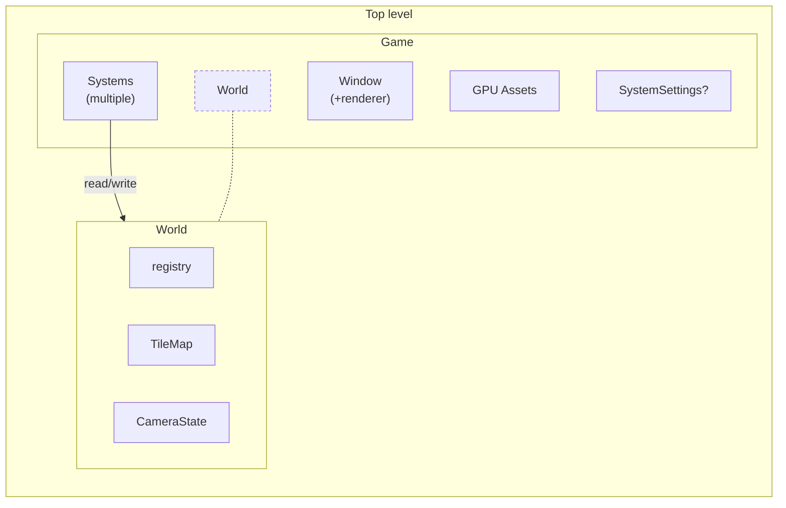
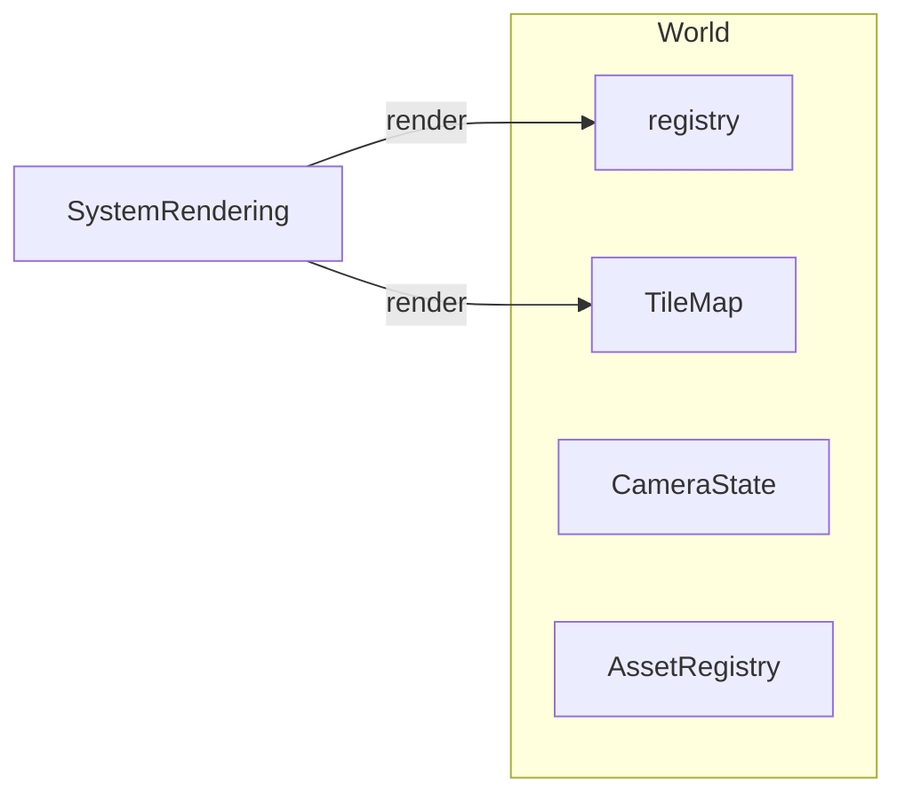
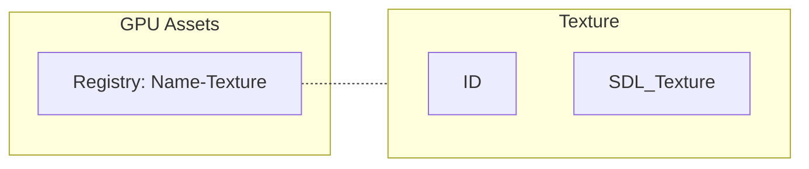

# Architecture

## Top level

```mermaid
flowchart LR
    subgraph TopLevel["Top level"]
        subgraph Game
            GameWorld["World"]
            Window["Window<br/>(+renderer)"]
            Systems["Systems<br/>(multiple)"]
            GPUAssets["GPU Assets"]
            SystemSettings["SystemSettings?"]
        end

        subgraph World
            registry
            TileMap
            CameraState
        end
    end

    Systems -->|read/write| World
    GameWorld -.- World

    style GameWorld stroke-dasharray: 4 3
```

`World` inside `Game` is a forward reference to the `World` module; `Systems` read/write into it.

## Rendering

```mermaid
flowchart LR
    SystemRendering["SystemRendering"]

    subgraph World
        registry
        TileMap
        CameraState
        AssetRegistry
    end

    SystemRendering -->|render| registry
    SystemRendering -->|render| TileMap
```

## GPU Assets

```mermaid
flowchart LR
    subgraph GPUAssets["GPU Assets"]
        TextureRegistry["Registry: Name-Texture"]
    end

    subgraph Texture
        ID
        SDL_Texture
    end

    TextureRegistry -.- Texture
```
